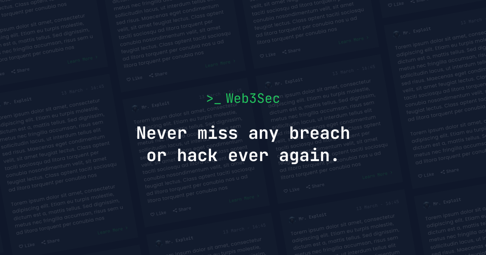

# Web3sec.News Blog 📄 
Welcome to the Web3sec.News Blog repository, an `Open Source ultimate community-driven platform 📖` for the latest news and insights on web3 development, security, blockchain technology, and audits. 

Here's a *step-by-step* guide on how to write a blog in Markdown format and submit a pull request (PR) to get your blog published on our website. Even if you're not a tech-savvy person, this guide will help you contribute your valuable content effortlessly and receive proper credits as the writer of the blog as you write.



## 🔥 Features

- [x] Share twitter threads as a blog of your own 🕊️
- [x] Enter any URL to get it's MD file, make some changes & raise a PR to publish 💪
- [x] Publish your own blog
- [x] Share tips from your own experience
- [x] Use appropriate hashtags for better visibility #️⃣
- [x] Get Credits for writing 🫵
- [x] Increase your chance to get noticed in the community
- [x] Show this as a proof of work for your next content-writing job
- [x] SEO-friendly
- [x] light & dark mode
- [x] fuzzy search
- [x] dynamic OG image generation for blog posts
- [x] Complete MD support

## 🚀 Project Structure
Inside of Web3sec.News, you'll see the following folders and files:

```bash
/
├── public/
│   ├── assets/
│   │   └── logo.svg
│   │   └── logo.png
│   └── favicon.ico
│   └── og.png
│   └── robots.txt
│   └── toggle-theme.js
├── src/
│   ├── assets/
│   │   └── socialIcons.ts
│   ├── components/
│   ├── content/
│   │   |  blog/
│   │   |    └── some-blog-posts.md
│   │   └── _schemas.ts
│   │   └── config.ts
│   ├── layouts/
│   └── pages/
│   └── styles/
│   └── utils/
│   └── config.ts
│   └── types.ts
└── package.json
```

Web3sec.news looks for `.astro` or `.md` files in the `src/pages/` directory. Each page is exposed as a route based on its file name.

Any static assets, like images, can be placed in the `public/` directory.

All blog posts are stored in `src/content/blog` directory.

## 🔎 Prerequisites
To get started, make sure you have the following:

- An account on [GitHub](https://github.com/). If you don't have one, you can sign up for free.
- Basic knowledge of Markdown syntax. If you're new to Markdown, check out this [Markdown Cheatsheet](https://www.markdownguide.org/cheat-sheet/) to get familiar with the syntax.

## ✍️ Writing and Submitting a Blog
Follow these steps to write and submit your blog:

1. **Fork the Repository**: Visit the [Web3sec.News Blog repository](https://github.com/Web3secNews/blog/) and click on the "Fork" button in the top-right corner of the page. This action will create a copy of the repository under your GitHub account.

2. **Clone the Forked Repository**: On your GitHub profile, locate the forked repository (`yourusername/blog`). Click on the "Code" button and copy the repository's URL. Open your preferred command-line interface, navigate to a directory where you want to store the repository, and execute the following command:
   ```
   git clone <repository-url>
   ```

3. **Create a New Branch**: Change to the repository's directory by running `cd blog`. Create a new branch for your blog using the following command:
   ```
   git checkout -b my-blog
   ```
   Replace `my-blog` with a descriptive branch name related to your blog content.

4. **Write Your Blog** : Inside the cloned repository, navigate to the `blogs` directory. Create a new Markdown file with a meaningful name for your blog (e.g., `my-blog.md`). Use any text editor to write your blog using Markdown syntax. You can refer to the aforementioned Markdown Cheatsheet for assistance.

   Here is the list of `Mandatory` property for each post.

   | Property          | Description                                                                     | Remark                                        |
   | ----------------- | ------------------------------------------------------------------------------- | --------------------------------------------- |
   | **_title_**       | Title of the post. (h1)                                                         | required<sup>\*</sup>                         |
   | **_description_** | Description of the post. Used in post excerpt and site description of the post. | required<sup>\*</sup>                         |
   | **_pubDatetime_** | Published datetime in ISO 8601 format.                                          | required<sup>\*</sup>                         |
   | **_tags_**        | Related keywords for this post. Written in array yaml format.                   | default = others                              |

   - Only `title`, `description` and `pubDatetime` fields in frontmatter must be specified.

   - Title and description (excerpt) are important for search engine optimization (SEO) and thus Web3sec.News encourages to include these in blog posts.

   - If you omit `tags` in a blog post (in other words, if no tag is specified), the default tag `others` will be used as a tag for that post.

   ### Sample Frontmatter

   Here is the sample frontmatter for a blog post.

   ```yaml
   # src/contents/sample-post.md
   ---
   title: The title of the post
   pubDatetime: 2022-09-21T05:17:19Z
   postSlug: the-title-of-the-post
   featured: true
   draft: false
   tags:
     - some
     - example
     - tags
   ogImage: ""
   description: This is the example description of the example post.
   ---
   ```

5. **Add Credits**: At the end of your blog, make sure to include appropriate credits to yourself as the writer. Add a section with your name or preferred credit information. For example:
   ```
   **About the Writer**
   
   - Name: Your Name
   - Website: Your Website (optional)
   - GitHub: [@your-username](https://github.com/your-username)
   - Twitter: [@your-handle](https://twitter.com/your-handle) (optional)
   ```

6. **Save Your Changes**: After writing and adding credits, save the file.

7. **Commit and Push**: In your command-line interface, run the following commands to commit and push your changes:
   ```
   git add blogs/my-blog.md
   git commit -m "Add my blog: My Blog Title"
   git push origin my-blog
   ```

8. **Submit a Pull Request**: Once you've pushed your changes to your forked repository, navigate to the original [Web3sec.News Blog repository](https://github.com/Web3secNews/blog/) on GitHub. You should see a banner with a message stating that your recently pushed branch has differences. Click on the "Compare & pull request" button.

9. **Review and Submit**: On the PR page, you can review the changes you made. Provide a descriptive title and description for your PR, summarizing your blog's content. Once you're satisfied, click on the "Create pull request" button.

Congratulations! You've successfully submitted your blog for review and publishing


## ✨ Feedback & Suggestions
If you have any suggestions/feedback, you can contact me via [my email](mailto:chirag@web3sec.news). Alternatively, feel free to open an issue if you find bugs or want to request new features.


---

Made with 🤍 by [Chirag Agrawal](https://twitter.com/__Raiders) 👨🏻‍💻
