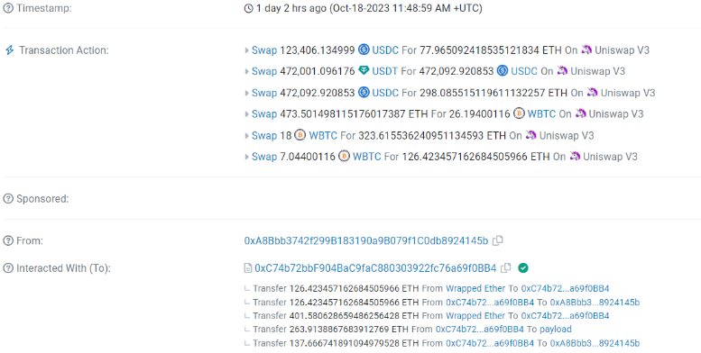
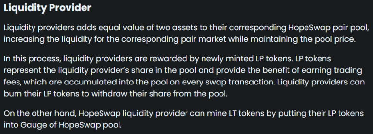
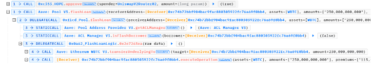
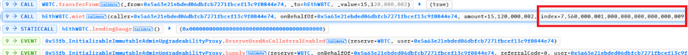
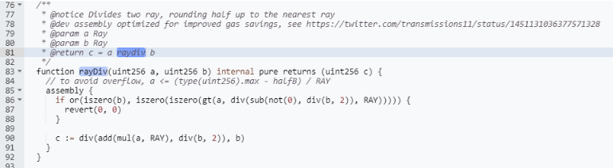
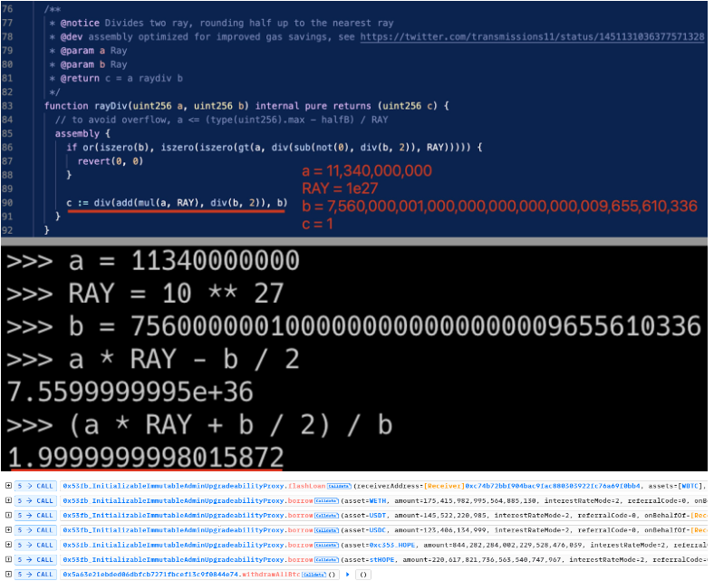

*Calling all Web3 developers and security enthusiasts! Contribute and gain recognition on **[web3sec.news](https://web3sec.news/)***

*The ultimate open-source platform for sharing Web3 security insights. Publish your **[blog topics](https://github.com/Web3secNews/blog)**, from the latest news to blockchain tech and audits, and receive feedback and exciting opportunities.*

**[Join the vibrant Web3 security community today 🤝](https://discord.com/invite/CseAxvtrZ3)**

### Introduction:

On October 18, 2023, the HopeLend protocol experienced a security breach resulting in a loss of approximately 528 ETH, valued at around $835k. The exploit came from a precision loss in the protocol’s interest fee calculation system. Precision loss is an incredibly important and often hard-to-spot vulnerability pattern. As protocols rely on deeper mathematics, precision loss vulnerabilities may become increasingly common. Let’s dive into what happened to HopeLend, and why it matters for all of DeFi. 

### Smart Contract Hack Intel:

- Hacker’s Address: [0x1F23](https://etherscan.io/address/0x1F23eb80f0c16758E4A55D48097c343bD20Be56f_), [0xa8bbb3](https://etherscan.io/address/0xa8bbb3742f299b183190a9b079f1c0db8924145b)
- Stolen funds address: [0x9a9122](https://etherscan.io/address/0x9a9122Ef3C4B33cAe7902EDFCD5F5a486792Bc3A)
- Victim Contract: [0xc74b7](https://etherscan.io/address/0xc74b72bbf904bac9fac880303922fc76a69f0bb4#code)
- HToken Fees Calculation Contract: [0x1c222](https://etherscan.io/address/0x1c2220437b068a8c124ac1d158f7f786fbea701e#code)
- Vulnerable Flashloan Logic Contract: [0x51ab0f9](https://etherscan.io/address/0x51ab0f9684d265a1defffc9701a6a3ce4ac50d98#code#F1#L225)
- Attack Transaction: [0x1a7ee0](https://etherscan.io/tx/0x1a7ee0a7efc70ed7429edef069a1dd001fbff378748d91f17ab1876dc6d10392)

> 

Fig: The attacker's initial transaction 

### Precision Loss explained:

Precision loss issues tend to stem from using low-precision data types for smart contract calculations. Whenever a contract performs division, some small amount of information tends to be lost as a rounding or truncation error. For smaller data types, this data loss gets even worse. 

For example, let’s consider a DeFi staking contract that uses a uint16 to store a user's accrued rewards. If the protocol calculates rewards as a percentage but stores them in only 16 bits, data might be lost in the process, causing smaller rewards to vanish. Over time, these lost fractions could accumulate, offering an attack vector for someone to siphon off the 'dust.'

The precision loss vulnerability in HopeLend enabled the attacker to distort their debt. While an ordinary user might borrow $1,000 and commit to repaying $1,100, the hacker manipulated it to make it seem like they only owed $100. This fee distortion allowed them to make a profit.

### A step-by-step breakdown:

- HopeSwap is based on liquidity providers that offer equal assets to pair pools in exchange for LP tokens and trading fees. The liquidity provider pool price internally uses liquidityIndex value. The system relies on this liquidityIndex to calculate fees and keep the system stable – incentivizing borrowing when supply is high, and constraining it when supply is low.

> 
 
- To kickstart their attack, the hacker took out a flash loan within HopeLend, allowing them to temporarily borrow a substantial amount of 2,000 Wrapped Bitcoin (WBTC) with no upfront collateral.

> 

- The attacker took the amount of the flash loan and added it to the reserve liquidity index of the pool contract. In this case, he specified an extremely high value for the liquidtyIndex option.

> 

- When the higher value of liquidityIndex within the hEthWBTC contract was passed the index value got changed the value from a regular 1e27 to an abnormally high 7,560,000,001e27. 

> 

- Because the liquidityIndex was set to such a big number (7,560,000,001e27), it created a major gap in the system's ability to track and calculate values, as shown in the image below.

> 

- This discrepancy, influenced by the initial manipulation, allowed the attacker to borrow assets from various markets at a significantly reduced cost, essentially paying back less due to altered fee calculations and lower flash loan fees, all stemming from the modified liquidityIndex.
 
- Fun fact: the hacker didn't profit, but a frontrunner made 264.08 ETH by bribing 263.91 ETH to a Lido-managed Validator

### Security Breach Analysis:

The attack's root cause was the imprecise handling of the liquidity index during the execution of the _handleFlashLoanRepayment() function. The liquidity index is crucial for accurate asset valuation, and its manipulation enabled the attacker to exploit the system's vulnerability, resulting in substantial gains.

> 

### Protection Strategies:

Because the SafeMath library has an automatic revert function in case of such vulnerabilities, use it for secure arithmetic operations to avoid overflows, underflows, and division errors.
To prevent loss of precision, division should always come after multiplication.
Multiply values to the number of decimal places on the token to represent them as integers. To convert all values to integers, for instance, multiply the values by 10^18 if you are working with a token that has 18 decimal places.

### Lessons Learned from the Security Incident?

Similar to what recently happened at Wise Lending. The protocol likely discarded high-precision values in favor of efficiency to save on gas expenses and complexity. However, as evidenced by the breach, this trade-off left the system vulnerable to precision loss attacks. In smart contracts, the accurate handling of floating-point numbers is crucial. In order to improve security, rigorous testing, notably invariant fuzz testing, is essential for improving security.

This blog was written in collaboration with [Nathan Ostrowski](https://www.octane.security/), If you care deeply about boosting your protocol’s security and reducing your spending on audits, They’ve just started accepting applications for next beta cohort.

Thank you for reading ✌🏻
